# Pilcrow

A production-grade, multi-provider AI chat platform. Bring your own OpenAI and
Anthropic keys, and get streaming chat, an admin panel to manage providers and
models, per-user theming, usage analytics and an audit trail.

Built with Next.js 16 (App Router), Supabase (Postgres + Auth + RLS), and
Tailwind. TypeScript throughout, strict mode, no `any` in the core paths.

[](https://github.com/muhamzes/pilcrow/actions/workflows/ci.yml)
[](LICENSE)

> **Built with AI assistance (Claude Code).** Architecture, security model, and
> debugging decisions are documented in the wiki
> ([docs/wiki/DECISIONS.md](docs/wiki/DECISIONS.md),
> [docs/wiki/ISSUES.md](docs/wiki/ISSUES.md)).

---

## What it does

**For the person using it**

- **Streaming chat** with token-by-token rendering, stop-generation, regenerate,
  and edit-and-resubmit
- **Ask the presses** — send one prompt to up to four models at once and read
  the answers side by side, each with what it cost, how many tokens it used, and
  how long it took to say its first word
- **Switch models mid-conversation** — Anthropic, OpenAI, Groq and Perplexity, in the
  same thread
- **Markdown with syntax-highlighted code**, sanitised against XSS, one-click copy
- **Conversation management** — search, rename, pin, delete
- **Seven themes** in light and dark. Six are palettes; the default, **Riso**,
  is a whole design system — a masthead instead of a navbar brand, conversations
  as bordered slips with a model stamp, 2px ink keylines and offset shadows
  instead of soft elevation, numbered picks, a boxed COMPOSE panel. Plus accent
  colour, font size and bubble style, persisted per user and applied with **no
  flash on load**
- **Command palette** (`⌘K`) and a keyboard-shortcut reference (`?`)

**For whoever runs it**

- **Encrypted provider keys** — AES-256-GCM at rest, never in a client bundle,
  never in a log, with a "test connection" that performs a real generation
  rather than an auth check
- **Model management** per provider, including per-1K token costs
- **Usage analytics** — messages per day, tokens by model, estimated spend
- **Rate limiting** (messages/hour) and a **daily token budget** (spend ceiling)
- **Audit log** of every admin mutation, with actor and timestamp
- **User management** — roles, suspension, per-user usage

## Screenshots

The deployment is invite-only, so these are the way in for anyone without an
account.

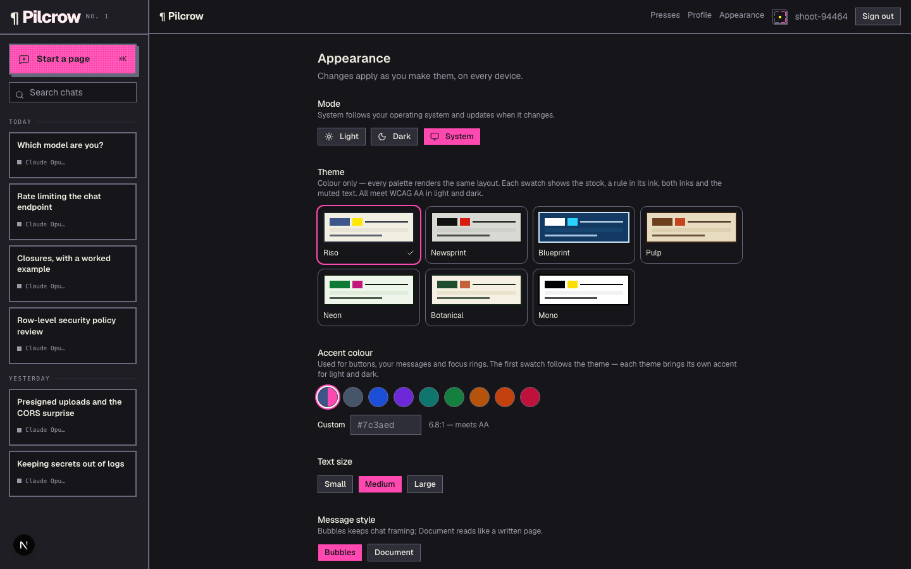

_The appearance panel in Riso dark — the live swatches for all seven presets, the
accent picker, and the fluorescent pink ink against near-black._

### The theme presets, generated rather than captured

> Generated by `npm run shoot`, not captured by hand — see
> [docs/screenshots/](docs/screenshots/). The script also fails on console
> errors, hydration mismatches, and theme markup leaking between presets.

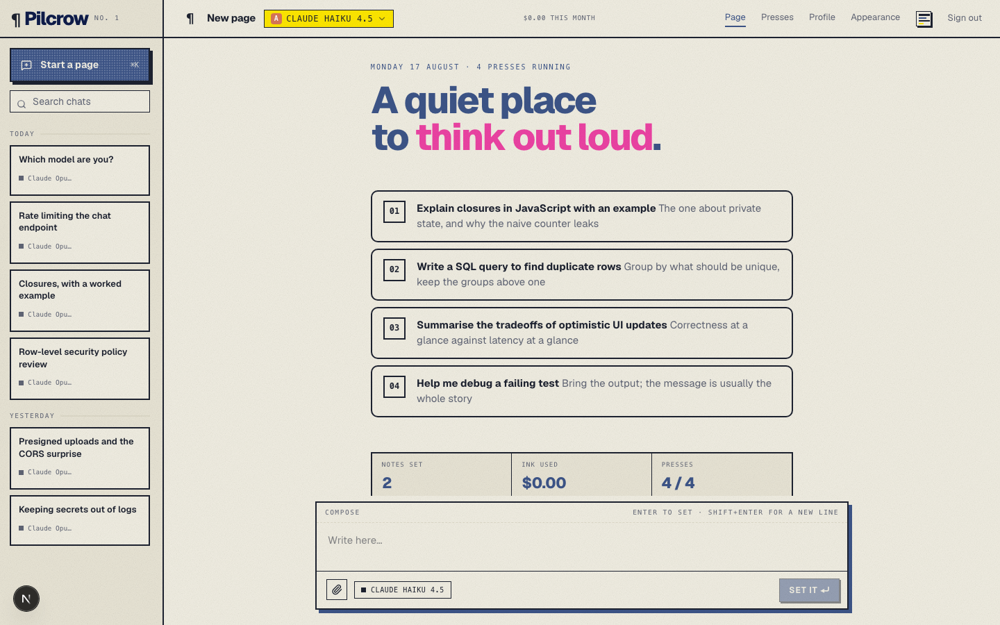

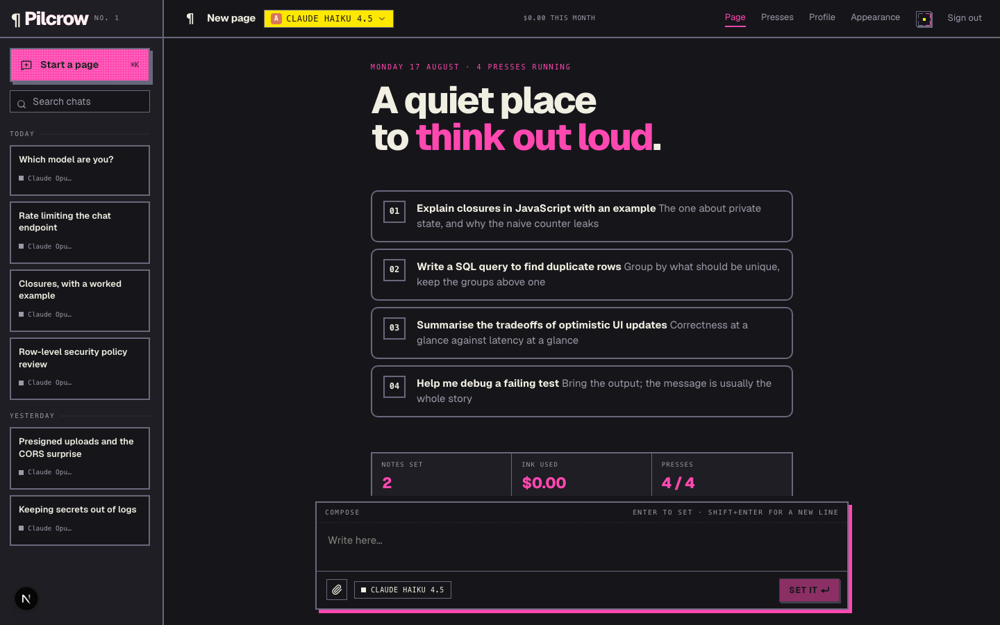


The three above are the same route, the same data and the same viewport — the
only difference is the stored theme. That is the whole claim of the theming work.

### The rest of the app, captured by hand

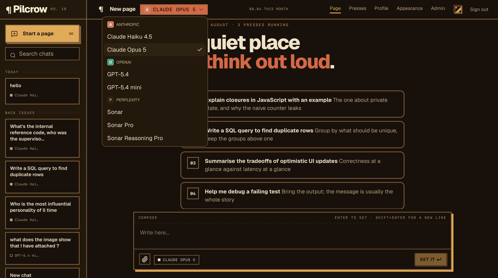

_The model picker open, every enabled model grouped under the provider that
serves it — Anthropic, OpenAI and Perplexity from one list._

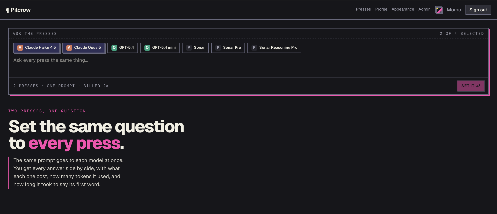

_Presses before a question: pick any subset of models and the footer states the
cost up front — two presses, one prompt, billed 2×._

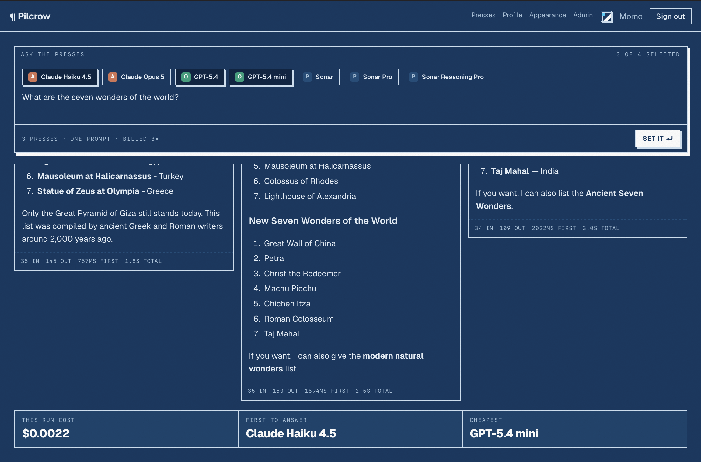

_The same prompt answered by three models at once, each column carrying its own
token counts and latency, with the cheapest and the first to answer called out._

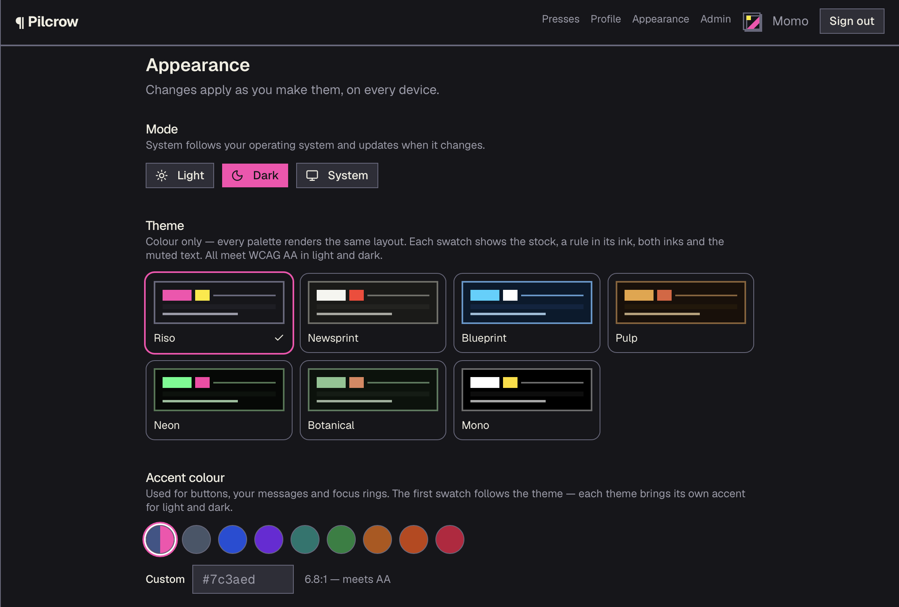

_Appearance: seven presets, light/dark/system, and an accent picker that reports
its own contrast ratio against WCAG AA._

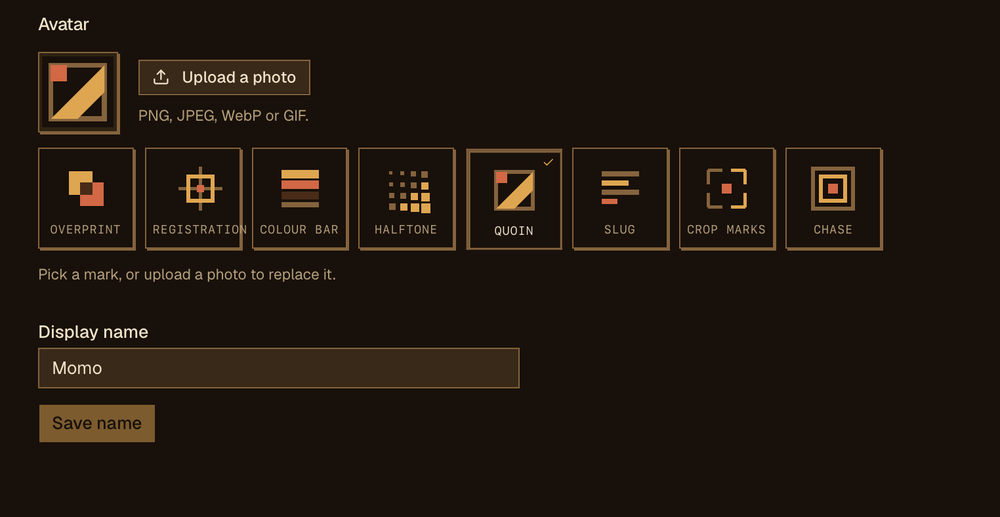

_Profile in Pulp — eight generated letterpress marks as avatars, or upload a
photo to replace them._

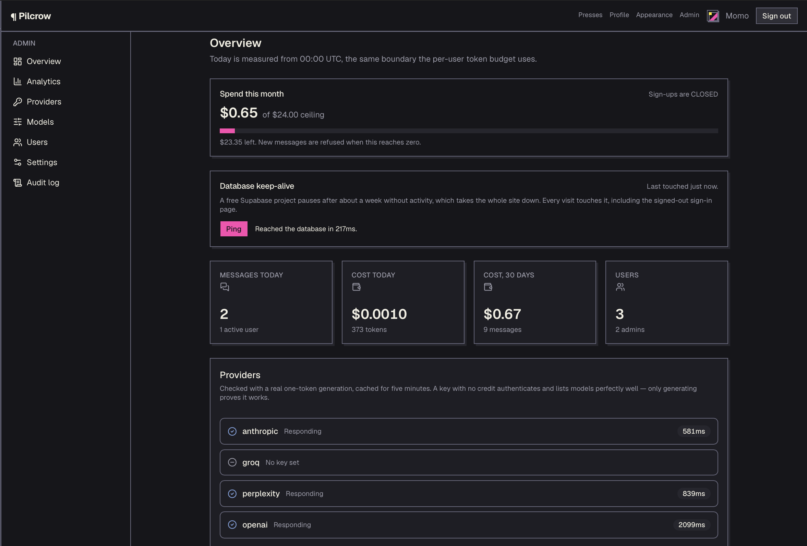

_Admin overview — spend against the monthly ceiling, the database keep-alive
ping, and a live per-provider health check proved by a real one-token call._

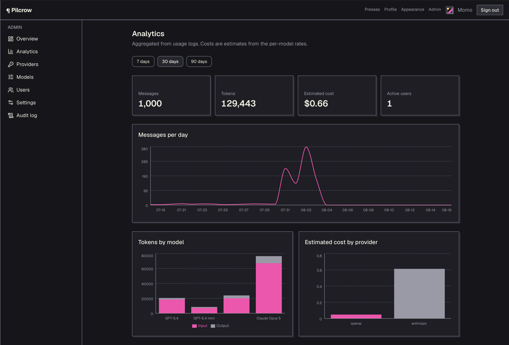

_Analytics over 30 days: messages per day, tokens by model, and estimated cost
split by provider._

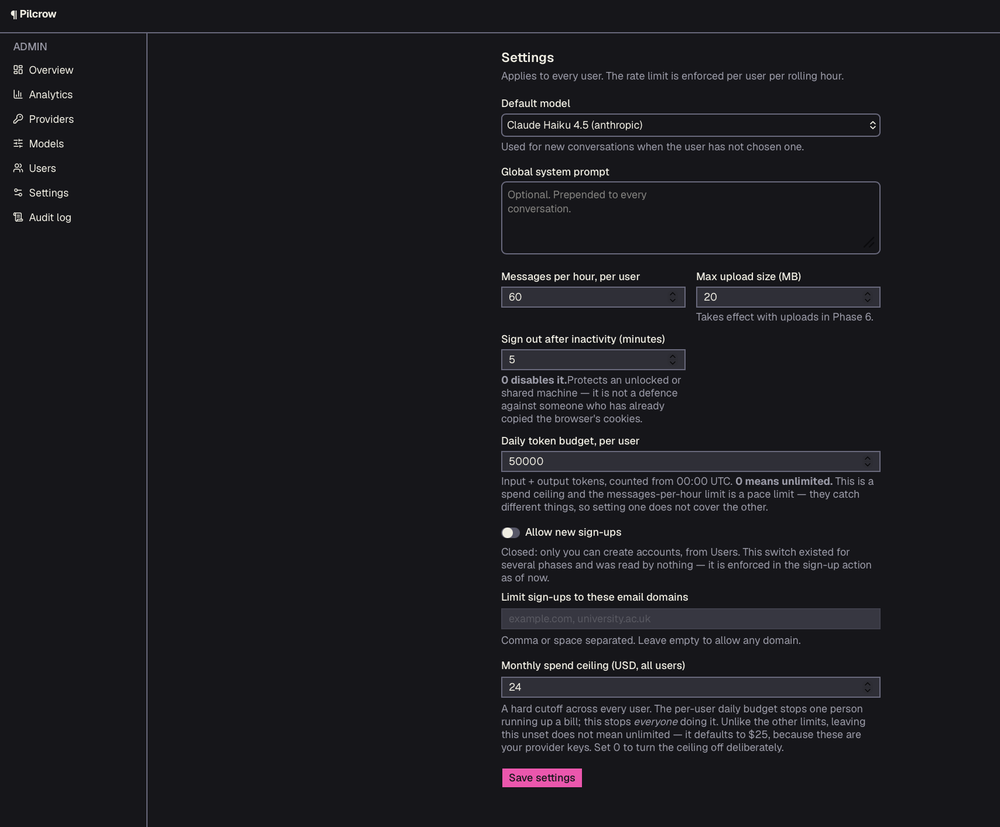

_System settings — default model, per-user rate and token limits, closed
sign-ups with a domain allowlist, and the monthly spend ceiling._

### Capturing the hand-shot four

> The table below is the guide for the polished marketing captures.

**Seed the demo data first**, or the analytics charts are three flat lines:

```bash
npm run seed -- --demo     # 24 conversations, 98 messages, 49 usage rows over 30 days
npm run dev
```

| File | Screen | Capture it in this state |
| --- | --- | --- |
| `chat.png` | `/` or `/c/<id>` | **Mid-stream, in Riso (the default) — this is the hero shot.** Send "Explain closures with an example", capture while tokens are still arriving so the cursor is visible. Model selector in shot. Sidebar showing several named conversations, not "New chat" ×3. Riso is what a first-time visitor sees, so the hero image should be it. |
| `model-selector.png` | `/` or `/c/<id>` | **Selector open**, not closed — shut, it is a label with a chevron and shows nothing. Click it so the listbox is expanded and the provider group headings are visible. Enable models under at least two providers first, or the grouping the shot exists to show is a single heading. |
| `long-thread.png` | `/c/<id>` | A thread long enough to have scroll — the seeded demo conversations are. Scrolled up from the bottom, so the **Scroll to bottom** pill is showing, with the cost-and-token line under at least one answer legible. |
| `themes.png` | `/settings` | **Riso in dark mode**, where the ink turns fluorescent pink against near-black. The live preview panel visible, and enough of the picker in frame to show the other six. Capturing a *different* theme here than in `chat.png` is the point — one image proves there is a default, two prove it is a choice. |
| `admin-providers.png` | `/admin/providers` | **After pressing Test connection**, so the green result and latency are on screen. Both provider cards visible with masked keys (`••••••••` + last four). |
| `admin-analytics.png` | `/admin/analytics` | The **30-day** range, so all three charts have shape. With demo data seeded this shows real variation rather than a flat line. |

Practical notes:

- **1600×1000** at 2× — legible on GitHub, not enormous in the repo.
- Check the header before you shoot: your account email is in it. Fine if you
  do not mind it public, worth signing in as a demo account if you do.
- A key's last four **is** rendered by design and is safe to show; the key
  itself never reaches the browser.
- The composer's paperclip works — R2 is configured and verified end to end
  against production ([ISSUE-016](docs/wiki/ISSUES.md), resolved). It disables
  itself only on a deployment where the `R2_*` variables are absent.

**These are captured while signed in, so read every shot before committing it.**
The account email sits in the header on every authenticated page; the sidebar
carries the titles of real conversations, and a title is generated from the first
message. Provider keys never reach the browser, so a key cannot leak from a
screenshot — but the last four does render, by design, and so does anything
typed into a thread. `git show --stat` will not tell you any of this. Only
opening the file will.

> `.gitignore` drops `docs/screenshots/*password*.png` on purpose — `/admin/users`
> shows a generated password once, in plaintext. Keep the word out of these
> filenames or the file will be ignored without saying so.

Six alternative interface concepts, as self-contained HTML, live in
[docs/mockups/](docs/mockups/) — open any of them directly in a browser.

## Status

**Live and working.** Phases 1–5 complete, 8 complete, 7 partial. Phase 6 (file
uploads and email) is configured: R2 is verified end to end against production
([ISSUE-016](docs/wiki/ISSUES.md), resolved), and Resend is configured with its
delivery leg still unproven ([ISSUE-017](docs/wiki/ISSUES.md)).

Two things are known and open: refresh-token reuse detection is off, which is a
Supabase dashboard setting ([ISSUE-028](docs/wiki/ISSUES.md)), and the
accessibility audit needs a browser that cannot be automated here.

The honest current state is [docs/wiki/PROGRESS.md](docs/wiki/PROGRESS.md);
known problems are [docs/wiki/ISSUES.md](docs/wiki/ISSUES.md); the reasoning
behind every non-obvious choice is
[docs/wiki/DECISIONS.md](docs/wiki/DECISIONS.md), including the arguments
against.

**There is no test framework and no test suite.** What exists is a
**verification harness**: 39 hand-written `verify:*` scripts under
[scripts/](scripts/), asserting against the real database, the real running
server or the real source. No `.spec.ts`, no `.test.ts`, no runner. A deliberate
choice, and the reasoning is in [Verification](#verification).

### Known gaps

Stated here rather than left to be discovered, because the spec in
[docs/00-PROJECT-SPEC.md](docs/00-PROJECT-SPEC.md) asks for all three:

- **Google OAuth is not implemented.** The spec calls for it; there is no
  `signInWithOAuth` call anywhere in the codebase. Authentication is
  email/password only ([app/(auth)/actions.ts](app/(auth)/actions.ts)).
- **Resend is barely wired in.** Five templates and five send functions exist in
  [lib/email/send.ts](lib/email/send.ts); only `sendNewLoginEmail` has a call
  site. Supabase Auth's built-in mailer handles signup confirmation and password
  reset, so "all transactional email through Resend" is **not** true of this
  build. The other four senders render and pass contrast checks but are never
  invoked.
- **CI does not deploy.** The `deploy` job in
  [.github/workflows/ci.yml](.github/workflows/ci.yml) is `if: false`. Railway
  deploys from GitHub on its own, **ungated by the CI checks above it** — so a
  red build does not stop a release. This is a deliberate trade to avoid two
  racing deployments per merge, explained in that file, but it means there is no
  CI-gated pipeline. Do not read the CI badge as a deploy gate.
- **One Supabase project** backs local development, CI and production
  ([ISSUE-015](docs/wiki/ISSUES.md)) — the reason most of the harness is
  excluded from CI.

### Where to start reading

| If you want | Read |
| --- | --- |
| What this is and how it holds together | [docs/SHOWCASE.md](docs/SHOWCASE.md) |
| Diagrams and request paths | [docs/ARCHITECTURE.md](docs/ARCHITECTURE.md) |
| To add a provider | [lib/providers/README.md](lib/providers/README.md) |
| To contribute | [CONTRIBUTING.md](CONTRIBUTING.md) — note that `main` rejects direct pushes |
| The current state in one screen | [docs/wiki/PROGRESS.md](docs/wiki/PROGRESS.md) |

---

## Requirements

- Node 18+ (developed on 24)
- A Supabase project
- Docker is **not** required — migrations run against the hosted database
  (see [DEC-004](docs/wiki/DECISIONS.md))

## Local setup

```bash
npm install
cp .env.example .env.local   # then fill in your Supabase values
npm run dev
```

### Environment

Every variable is documented in [.env.example](.env.example). The four needed to boot:

| Variable | Where to find it |
|---|---|
| `NEXT_PUBLIC_SUPABASE_URL` | Supabase → Project Settings → Data API |
| `NEXT_PUBLIC_SUPABASE_ANON_KEY` | Project Settings → API Keys → publishable (`sb_publishable_…`) |
| `SUPABASE_SERVICE_ROLE_KEY` | Project Settings → API Keys → secret (`sb_secret_…`) — **server only** |
| `SUPABASE_DB_PASSWORD` | Project Settings → Database — used by the CLI for `db push` |
| `ENCRYPTION_MASTER_KEY` | Generate: `openssl rand -base64 32` — see the warning below |

> **`ENCRYPTION_MASTER_KEY` is unrecoverable.** Every provider API key in the database is
> encrypted with it. Lose it and they all have to be re-entered; rotating it means
> re-encrypting every stored key. The same value must be set in Railway at deploy time.

> This project uses Supabase's **new** API key format (`sb_publishable_` / `sb_secret_`), not
> legacy `anon` / `service_role` JWTs. They are opaque strings — never decode them as JWTs.
> The variable names are legacy-styled on purpose; see [DEC-003](docs/wiki/DECISIONS.md).

## Database

Migrations live in [supabase/migrations/](supabase/migrations/) and apply to the hosted project.

```bash
npm run db:push      # apply pending migrations
npm run seed         # create the first admin user + default settings
npm run keys:encrypt # move provider keys from .env.local into encrypted DB storage
```

`npm run seed` needs `SEED_ADMIN_EMAIL` and `SEED_ADMIN_PASSWORD` in `.env.local`. It is
idempotent — safe to re-run.

`lib/db/types.ts` is hand-maintained because `supabase gen types` needs Docker. **If you change
a migration, update that file in the same commit.**

## Verification

**This is a verification harness, not a test suite.** There is no test
framework, no runner, and no `.spec.ts` or `.test.ts` file in the repository —
39 hand-written `verify:*` scripts in [scripts/](scripts/), run by `tsx`, each
exercising something real. Over 800 assertions in total. Ten of the 39 drive
Playwright directly, as a library rather than as a test runner.

The bugs this project actually hit were not the kind a mocked unit test catches,
so the pattern throughout is **assert stored state, not response shape**: several
real defects here produced responses indistinguishable from success.

Calling it a test suite would oversell it in two specific ways worth being
explicit about — there is no coverage measurement, and nothing runs on a
pre-commit hook.

```bash
npm run lint && npm run type-check && npm run build

npm run verify:all              # all 39 scripts, in a safe order
npm run verify:all -- --offline # only the ones needing no server
```

`verify:all` refuses to start if a previous run left the database dirty, and
re-checks after each script that mutates shared state — so a leak is reported by
the run that caused it rather than the next one to trip over it.

**In CI, only the credential-free subset runs** — 11 of the 39 scripts
(`verify:theme`, `verify:email`, `verify:headers`, `verify:authz`,
`verify:attachments`, `verify:degradation`, `verify:resilience`,
`verify:logging`, `verify:csv`, `verify:session`, plus `verify:bundle` in the
build job). The rest need a database, a running server or provider keys, and are
excluded on purpose: there is one Supabase project behind local, CI and
production, and `verify:admin` mutates shared state, so a CI run that died
mid-script could disable a provider for live users
([ISSUE-015](docs/wiki/ISSUES.md)). **A green CI badge therefore covers about a
quarter of the harness**, and none of the database, RLS or streaming checks.

The table below is a selection, not the full 39 — `npm run` lists them all.

| Script | Proves | Needs |
|---|---|---|
| `verify:authz` | no action or route was shipped without an auth gate | — |
| `verify:headers` | the security-header and CSP configuration | — |
| `verify:theme` | WCAG AA contrast across every theme, both modes | — |
| `verify:boundaries` | no server render calls a function that lives on the client | — |
| `verify:email` | email templates render and meet contrast | — |
| `verify:schema` | every table, view and function exists | database |
| `verify:rls` | user A cannot read or write user B's rows | database |
| `verify:seed` | exactly one admin, settings intact | database |
| `verify:security` | throttling, password rules, rate limit, token budget | database |
| `verify:storage` | presign/download rejection paths | database |
| `verify:gates` | anonymous and non-admin redirects | server |
| `verify:appearance` | the chosen theme is in the server-rendered HTML | db + server |
| `verify:chat` | a real streamed completion, persistence, stop, XSS | db + keys |
| `verify:providers` | no vendor SDK or name escaped `lib/providers` | db + keys |
| `verify:admin` | breaking **only** the DB key breaks chat — no silent env fallback | database |
| `security:audit` | secret shapes, advisories, RLS read from the **pg catalog** | database |
| `smoke` | a *running deployment*: headers as served, gates, assets | server |

```bash
npm run security:audit -- --history   # adds a full git-history secret scan
npm run smoke -- --url https://your-app.example.com
```

Scripts marked "server" need `npm run dev` running; override the target with
`BASE_URL=http://localhost:3001`. They create throwaway users and delete them
afterwards.

⚠️ `verify:admin` and `verify:security` **mutate shared state** — they break a
provider key or change a system setting and restore it in `finally`. Do not run
them against a database that matters while someone else is using it
([ISSUE-015](docs/wiki/ISSUES.md)).

## How it is put together

Three Supabase clients, and the distinction matters:

| Module | Key | RLS |
|---|---|---|
| [lib/db/client.ts](lib/db/client.ts) | publishable | enforced |
| [lib/db/server.ts](lib/db/server.ts) | publishable, cookie-bound | enforced |
| [lib/db/admin.ts](lib/db/admin.ts) | **secret** | **bypassed** |

`admin.ts` is marked `server-only`, so importing it from a Client Component is a build error.

Security posture:

- RLS on every table; `usage_logs` and `audit_logs` are read-only to clients and written server-side
- `providers.encrypted_api_key` is protected by **column-level grants**, not RLS — RLS is
  row-level and cannot hide a column. Clients read [`providers_public`](supabase/migrations/) instead.
- `profiles.role` is pinned by a trigger, so a user cannot promote themselves
- Route protection is layered: `proxy.ts` redirects, and every protected page re-checks
  server-side. Middleware is a convenience gate, not the boundary.

## Adding a new AI provider

One adapter file in [lib/providers/](lib/providers/) implementing `ChatProvider`, one line
in the registry, and database rows. No route or UI changes. Full instructions and the
vendor differences the abstraction absorbs: [lib/providers/README.md](lib/providers/README.md).

`npm run verify:providers` enforces this with `git grep` — no vendor SDK import and no
provider name may appear outside `lib/providers`.

### The key path

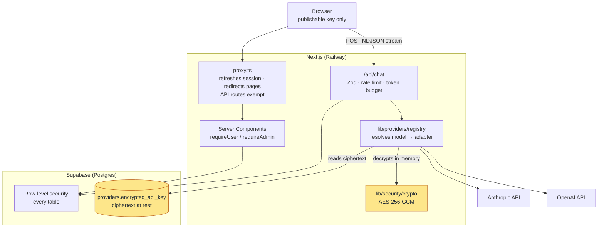

**The key path is the part worth understanding.** A provider key is stored only
as ciphertext. `registry.ts` reads it, decrypts it with the master key from the
environment, and hands the plaintext to an adapter instance — which lives for one
request. No key ever crosses into a client bundle, and every module on that path
imports `server-only`, so an accidental client import fails the build rather than
leaking.

## Deployment

Live at `myaichat-production.up.railway.app`, deploying from `main`.

**Environment variables** — set these in Railway (Variables → Raw Editor):

```
NEXT_PUBLIC_SUPABASE_URL
NEXT_PUBLIC_SUPABASE_ANON_KEY
SUPABASE_SERVICE_ROLE_KEY
ENCRYPTION_MASTER_KEY
NEXT_PUBLIC_APP_URL
```

Provider API keys are **not** among them — those live encrypted in the database
after Phase 4.

> `ENCRYPTION_MASTER_KEY` must match the value used to encrypt the stored keys,
> character for character. A different value means production cannot decrypt them.

**Health check:** `/api/health` returns 200 only when the database is reachable
*and* the encryption key is present. It deliberately checks dependencies rather
than returning a bare "ok" — a process that is up but cannot reach its database
is not healthy, and a check that says otherwise makes a broken deploy look
successful.

**Migrations** are promoted with `npm run db:push`, which applies any pending
files in `supabase/migrations/` to the linked project. There is currently one
Supabase project for local and production (ISSUE-015).

**CI** runs lint, type-check, formatting, build and the credential-free subset of
the verification harness on every PR.

**CI does not gate the deploy, and nothing here should be read as a pipeline.**
The `deploy` job in `.github/workflows/ci.yml` is `if: false`. Railway deploys
from GitHub on its own, which means a merge ships whether or not the checks above
it went green. That is a deliberate trade — enabling both would produce two
racing deployments per merge — and the comment in that file gives the three steps
to move deployment behind the gates. Until step 1 of those is done, disabled is
the correct state, but the honest description is "CI reports, Railway ships",
not "CI deploys".

## Project layout

```
app/(auth)/      login, signup, auth server actions
app/(app)/       protected shell, chat root, /admin
lib/db/          Supabase clients, session refresh, generated-ish types
lib/security/    auth gates, Zod schemas
lib/providers/   LLM adapters — the only place a vendor SDK is imported
lib/r2/          object storage — configured, private bucket, presigned URLs
lib/theme/       theme tokens, CSS generation, contrast maths
components/      chat, admin, theming, motion, command palette
emails/          Resend templates — configured; only the new-login send is wired
scripts/         seed + the 39-script verification harness
supabase/        migrations, committed and applied in order
docs/wiki/       progress, issues, decisions, roadmap
docs/mockups/    six self-contained interface concepts
```

## Contributing

Issues and pull requests welcome — [CONTRIBUTING.md](CONTRIBUTING.md) has the
setup, the branch/PR flow and the house rules.

The one thing worth knowing up front: **`main` rejects direct pushes**,
including the maintainer's. Every change goes through a pull request with CI
green. A `GH006` on `git push origin main` is the rule working, not a fault.

## Security

Provider keys are encrypted at rest and never reach the client. Every table has
row-level security. If you find a vulnerability, please report it privately —
see [SECURITY.md](SECURITY.md), which also documents the known gaps rather than
pretending there are none.

## License

[MIT](LICENSE) © 2026 Muhammad Bin Zeeshan
